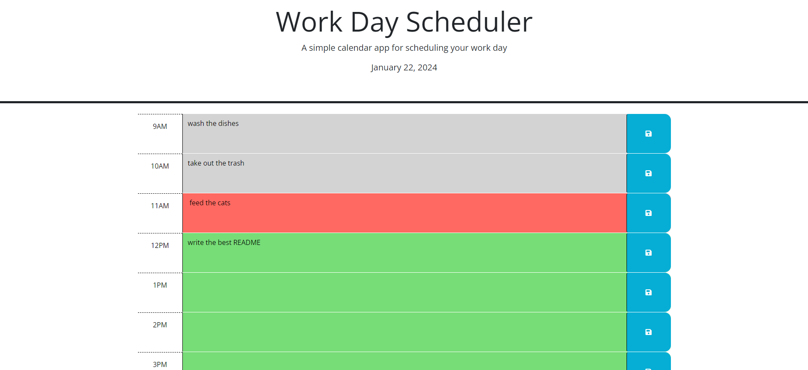

# work-day-scheduler

## This is a daily calendar that allows the user to add events.

This project was to create a work day planner. In this planner, the user can list tasks to be completed at certain times throughout the day and keep track of appointments. The user will type the tasks to be completed beside the correct time and click on the save button. When the user clicks on the save button, the task will be saved in the local storage. If the user refreshes the page, the task will be retrieved from local storage and displayed in the appropriate time block.

Another feature of this planner is to color the time blocks based on specified criteria. The time block(s) that are past will be colored gray, the time block that is at the current time is colored red, and the time block(s) that are still remaining will be green.

I learned several things by completeing this project. In past projects, I have written a lot of code that repeats for individual items. The items have been similar in structure but varied with ID's. I challenged myself to rewrite my similar code using variables that can be used for similar items. In this project, there were nine different time blocks that all performed the same function when the save button was clicked. I rewrote the code to make one function work for all the save buttons using the parent ID.

Another example of this was assigning the color classes for the past, present and future times. I wanted to write one block that would handle each block. I used a for loop with if statements to loop through each time and decide which class would be assigned to the time block.

The last example was retrieving the stored data from local storage. I wanted to write a block of code that would cycle through each block and display the stored values for that time block. I used another for block with each hour to loop through storage and display the value (if any) that was stored.

This was an excellent challenge for me because it forced me to explore new ways to write streamlined code. It made my code shorter and efficient. I learned and used the basics of the following concepts:

- this
- fetching parent IDs
- using parent IDs to perform tasks on children elements
- using dayjs in my code

In the future, I would like to revisit this code and implement:

- code to make the date/time/colors update automatically without having to refresh the page
- a code to clear the local storage at midnight automatically

## Credits

I referenced the following websites/tutorials to complete this project:

- dayjs documentation
- MDN documentation
- jquery documentation
- W3Schools website
